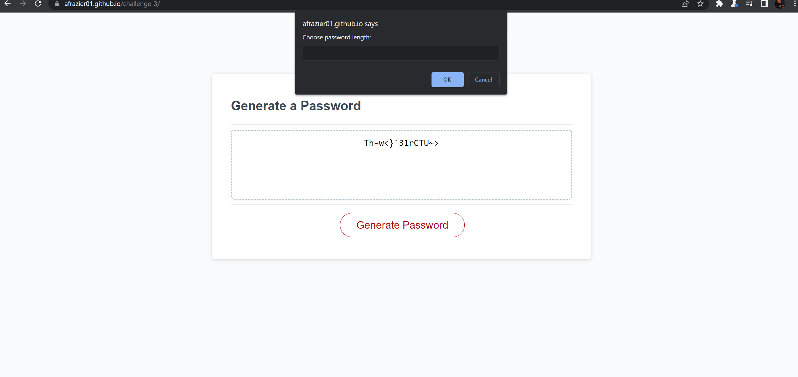

# challenge-3

## Description

The challenge for this assignment was to write a program that will generate a random password based on the criteria a user provides. This challenge features dynamically updated HTML and CSS that is powered by Javascript.

In this project I learned how to practice:
- Identifying and Declaring Variables and Functions: to make HTML and CSS dynamic and store values for logic.
- Conditional statements: To add logic to code.
- Iteration: to iterate over an array with a for loop.

## Installation

N/A

## Usage

Click [Here](https://afrazier01.github.io/Password-Generator/) to go to the deloyed webpage. Begin by clicking the generate password button in the middle of the screen, then answer the prompts and confirm your inputs before password is generated. 

Once the webpage is open, view logged messages and variables to console by using Chrome DevTools. Right-click and select inspect; or for windows - Control + Shift + I and for MacOS - Command + Option + I. Navigate to the the console tab to observe how the webpage is functioning.

Here is a look at the deployed webpage:

## Credits

N/A

## License

Please refer to the LICENSE in the repo.

